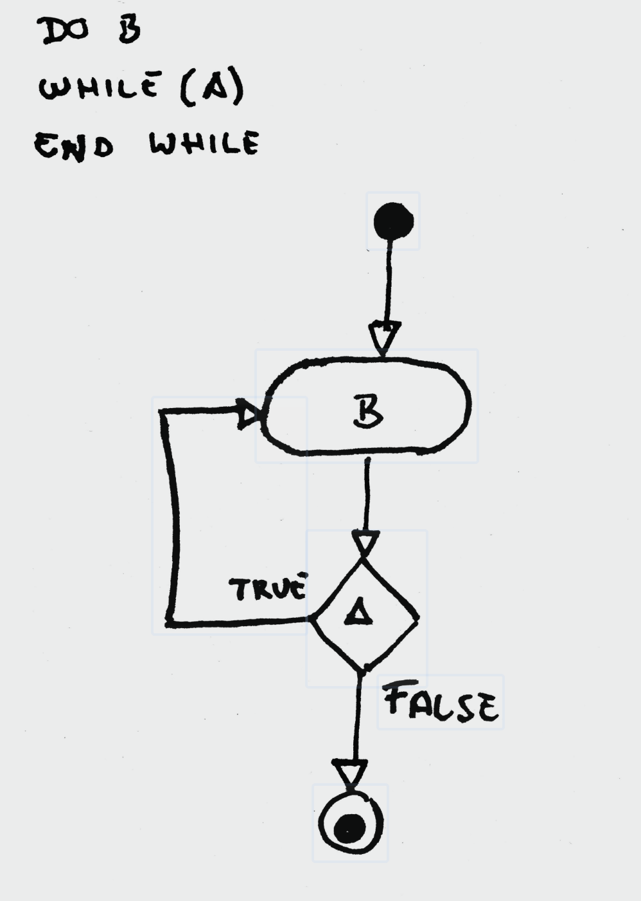

순서와 상관 O 뽑는다면 >> 순열
순서와 상관 X 뽑는다면 >> 조합

1,2,3 에서 3개를 뽑는다
1,2,3

1,2,3을 순서와 관계 없이 -> 조합
1,2,3을 순서와 관계 없이 -> 순열 
1,2,3 1,3,2 2,1,3 2,3,1 3,1,2 3,2,1 -> 총 6개

3개 중에서 2개를 뽑는다(조합)
1,2 2,3 1,3 총 3개

순열이라면
1,2 2,1 1,3 3,1 2,3 3,2

즉 순서와 상관 없는 것은 1,3과 3,1이 같은 것이고 순서와 상관이 있다면 1,3과 3,1은 다르다.

next_permutation[시작지점, 끝지점)
끝지점은 포함되지 않기 때문에 배열의 마지막 부분 그 다음을 넣어야 한다.
오름차순 정열된 기반으로 순열을 만든다.

prev_permutation은 내림차순을 기반으로 순열을 만든다.

do-while 문의 로직 흐름
최초 실행 (do): 조건이 맞든 틀리든 상관없이 do { ... } 블록 안의 코드를 무조건 한 번 실행
for(int i : a) cout << i << " ";가 실행되어 첫 번째 조합인 1 2 3이 출력.
조건 검사 (while): 블록 실행이 끝나면 while(조건) 문으로 내려와서 조건을 검사
여기서는 next_permutation 함수가 실행됩니다. "다음 순열이 있어?"라고 확인하고, 있으면 배열을 다음 순서로 바꾼 뒤 true를 반환
재진입: 조건이 true라면 다시 위쪽의 do 블록으로 점프하여 코드를 반복
종료: 조건이 false가 되면(더 이상 다음 순열이 없으면) 반복문을 탈출

1 2 3 
1 3 2 
2 1 3 
2 3 1 
3 1 2 
3 2 1 

값 출력을 확인한다.